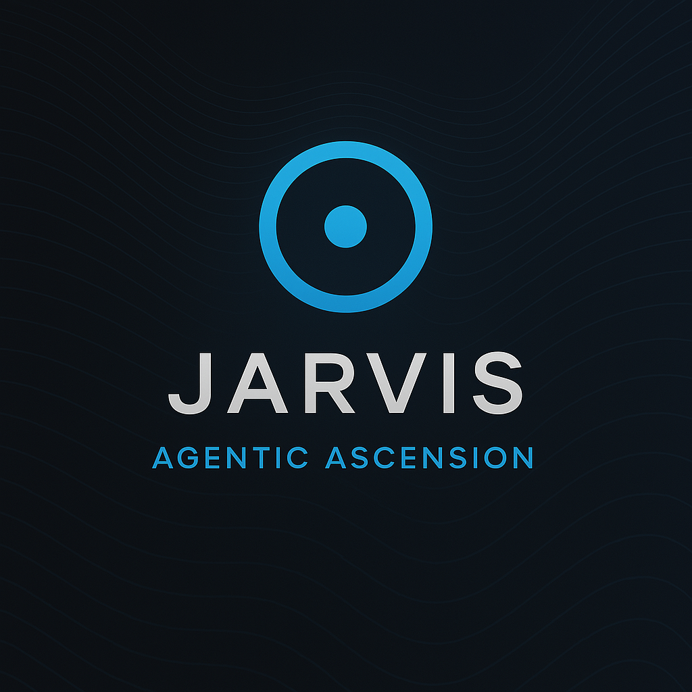

# JARVIS: An AI-Powered Desktop Assistant

<p align="center">
  
</p>

JARVIS is a powerful desktop assistant that combines voice transcription, AI-powered command processing, and a modern PyQt6-based UI. The application provides seamless integration with OpenAI's APIs for transcription, code generation, and conversational AI, all accessible through an elegant floating interface.

## Features

### Voice Commands
- **Voice Recording and Transcription**:
  - Hold Right Shift to record, release to transcribe
  - Hold Ctrl + Right Shift to transcribe and auto-type the result

### AI Command Processing
- **Code Generation and Assistance**:
  - Generate, optimize, and refactor code
  - Format code snippets automatically
  - Support for clipboard integration

- **Natural Language Queries**:
  - Ask questions and get AI-powered responses
  - Stream responses in real-time for immediate feedback

### Modern User Interface
- **Floating, Translucent Dialog**:
  - Always-on-top interface for quick access
  - Adjustable font size with + and - keys
  - Rich text formatting with syntax highlighting
  - Model selection dropdown

- **Conversation History**:
  - Track and view conversation history
  - See streaming updates in real-time

## Requirements

- Python 3.12 or higher
- NVIDIA GPU with CUDA 12.6 support (recommended for optimal performance)
- Windows 10 or higher

## Installation

### Using UV Package Manager

This project uses UV, a high-performance Python package manager written in Rust, for dependency management:

1. **Install UV**:
   ```powershell
   # Windows (PowerShell)
   iwr -useb https://astral.sh/uv/install.ps1 | iex
   ```

2. **Clone the repository**:
   ```powershell
   git clone https://github.com/mort-sh/jarvis.git
   cd jarvis
   ```

3. **Create and activate virtual environment**:
   ```powershell
   uv venv
   .venv\Scripts\activate
   ```

4. **Install dependencies**:
   ```powershell
   uv pip install -e .
   ```

5. **Set up environment variables**:
   Create a `.env` file in the project root:
   ```
   OPENAI_API_KEY=your_api_key_here
   ```

## Usage

### Starting the Application

```powershell
python main.py
```

Add the `--debug` flag for detailed logging:
```powershell
python main.py --debug
```

### Command Categories

1. **Format Commands**:
   - "format as code" - Wrap clipboard text in markdown code blocks
   - "wrap in code" - Format text as code

2. **Code Commands**:
   - "optimize [code]" - Improve code efficiency
   - "update [code]" - Update existing code
   - "refactor [code]" - Restructure code
   - "fix [code]" - Debug and correct code issues
   - "implement [description]" - Generate new code
   - "write [description]" - Write code from scratch

3. **Query Commands**:
   - "tell me about [topic]" - Get detailed information
   - "what is [concept]" - Get definitions
   - "how to [task]" - Get step-by-step instructions
   - "explain [topic]" - Get detailed explanations

4. **System Commands**:
   - "exit" or "quit" or "close" - Close the application
   - "talk [text]" - Simulate typing the text

### Keyboard Shortcuts

- **Right Shift**: Start/stop voice recording
- **Ctrl + Right Shift**: Record and auto-type
- **Plus (+)**: Increase font size
- **Minus (-)**: Decrease font size
- **Escape**: Hide dialog

## Project Architecture

JARVIS is built with a modular architecture that emphasizes:

- **Single Responsibility Principle**: Each module has a clear, focused purpose
- **Open/Closed Design**: Components are extensible without modification
- **Dependency Inversion**: High-level modules depend on abstractions, not details

### Core Components

```
jarvis/
├── ai/
│   └── openai_wrapper.py    # OpenAI API integration
├── audio/
│   └── ...                  # Audio processing components
├── commands/
│   └── command_library.py   # Command processing system
├── config/
│   └── settings.py          # Application configuration
├── services/
│   └── transcription_worker.py  # Audio transcription
├── ui/
│   ├── controller.py        # UI control logic
│   ├── popup_dialog.py      # Main UI component
│   └── workers/             # Background workers
└── state.py                 # Application state management
```

## Advanced Features

- **Model Caching**: Intelligent caching system to reduce API calls
- **Error Handling**: Comprehensive error capture and recovery strategies
- **Streaming Responses**: Efficient chunk-based streaming for real-time output
- **GPU Acceleration**: CUDA support for faster audio processing

## Contributing

1. Fork the repository
2. Create a feature branch: `git checkout -b feature/your-feature-name`
3. Follow code style guidelines:
   - Use type hints for all function parameters and returns
   - Follow PEP 8 guidelines
   - Run formatting tools (ruff) before committing
4. Submit a pull request with a clear description of your changes

## Troubleshooting

### Common Issues

1. **API Key Issues**:
   - Verify API key is correctly set in .env file
   - Check API quota and limits

2. **Audio Recording Issues**:
   - Ensure microphone is properly connected
   - Check system permissions

3. **UI Issues**:
   - Verify PyQt6 installation
   - Update required packages

## License

MIT License. See LICENSE file for details.

## Acknowledgments

- OpenAI for their powerful API and models
- PyQt6 for the UI framework
- The Whisper team for the speech recognition model
